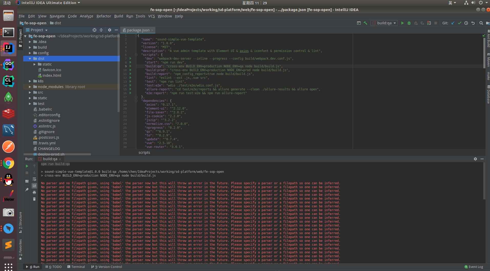

## vue项目部署到Kubernetes(K8S)集群
    使用nginx作为基础镜像,并兼容vue-router的hash和history模式,构建vue工程Docker镜像;kustomize进行Kubernetes(K8S)集群服务进行管理
### 项目打包
    根据环境打包,生成dist文件
   

###  镜像打包上传
    cmd切换到项目根目录,包含dist文件夹、Dockerfile文件
   
    
    推荐使用使用兼容vue-router(hash,history)模式的Dockerfile文件
   [兼容的Dockerfile配置](./Dockerfile)
   
   [default.conf配置](./nginx-conf/default.conf)
   
    
- 基础命令构建；   
```text
docker build -t chat-manage-frontend:1.0.1 .
docker images -> 查询[ImageId] 15f7d3c8a063
sudo docker tag [ImageId] registry.cn-shenzhen.aliyuncs.com/ac-pro/chat-manage-frontend:[镜像版本号]
    sudo docker tag 15f7d3c8a063 registry.cn-shenzhen.aliyuncs.com/ac-pro/chat-manage-frontend:1.0.1
sudo docker push registry.cn-shenzhen.aliyuncs.com/ac-pro/chat-manage-frontend:1.0.1
```    

- 使用make工具构建
```text
#打包服务
DOCKER_IMAGE_REPO=registry.cn-shenzhen.aliyuncs.com/ac-pro

build-push-image-chat-manage-frontend:
	@docker build -t $(DOCKER_IMAGE_REPO)/chat-manage-frontend:$(DOCKER_IMAGE_VERSION) .
	@docker push $(DOCKER_IMAGE_REPO)/chat-manage-frontend:$(DOCKER_IMAGE_VERSION)
```

    
### K8S操作
    cmd切换到overlays进行不同环境服务操作
   
   
    a.部署、更新
        kustomize build qa | kubectl apply -f-     
    b.移除
        kustomize build qa | kubectl delete -f-

### 本地调试
    使用port-forward进行端口映射到本地
    kubectl -n 命名空间名称（内部端点值，中间部分） port-forward svc/服务名（内部端点值，左边部分） 本地端口:远程端口
    kubectl -n sonicmoving-qa port-forward svc/sonicmoving-platform-service-frontend 8089:80
   
   
## vue-router的hash和history模式配置比对
```text
不同vue-router模式下,构建服务Docker镜像的Dockerfile配置文件不同
hash模式 -> 地址栏带有#字符, 支持F5刷新
history模式 -> 地址栏无#字符, 默认不支持F5刷新(需后台配置才能支持F5刷新)
```


### hash模式
- 地址栏url格式
```text
http://localhost:9527/#/login?redirect=%2Findex
http://localhost:9527/#/index
http://localhost:9527/#/applet/applet/user-list
```
- Dockerfile文件内容(可使用history模式Dockerfile)
```text
FROM nginx:latest
MAINTAINER jiacheng.chen
COPY dist/ /usr/share/nginx/html/
```
- ingress配置
```text
apiVersion: networking.k8s.io/v1beta1
kind: Ingress
metadata:
  name: ingress-chat-dev
  annotations:
    nginx.ingress.kubernetes.io/cors-allow-headers: >-
      DNT,X-CustomHeader,Keep-Alive,User-Agent,X-Requested-With,If-Modified-Since,Cache-Control,Content-Type,Authorization
    nginx.ingress.kubernetes.io/cors-allow-methods: 'PUT, GET, POST, OPTIONS'
    nginx.ingress.kubernetes.io/cors-allow-origin: '*'
    nginx.ingress.kubernetes.io/enable-cors: 'true'
    nginx.ingress.kubernetes.io/service-weight: ''
    nginx.ingress.kubernetes.io/proxy-body-size:  "10m"
    # 此配置需要在基于nginx基础镜像构建前端Docker镜像时设置
#    nginx.ingress.kubernetes.io/configuration-snippet: |
#      try_files $uri $uri/ /index.html;
spec:
  rules:
    - host: test.com
      http:
        paths:
          - path: /
            backend:
              serviceName: chat-manage-frontend-service
              servicePort: 80
```


### history 模式
- 地址栏url格式
```text
http://localhost:9527/login?redirect=%2Findex
http://localhost:9527/index
http://localhost:9527/applet/applet/user-list
```

- Docker镜像构建说明(支持F5刷新)
```text
nginx Docker镜像重新挂载『/etc/nginx/conf.d/default.conf』文件,default.conf文件添加配置: try_files $uri $uri/ /index.html;
相关命令:
获取前端工程在K8S中pod名称: kubectl -n ac-dev get pod
查看pod信息: kubectl exec -n ac-dev -it chat-manage-frontend-service-7b447c8845-q9sg2 -- /bin/bash
构建用于Docker构建时挂载的default.conf(nginx配置文件nginx.conf包含default.conf文件):
    cd /etc/nginx/
    cat nginx.conf
    cd conf.d/
    cat default.conf
    复制default.conf文件内容到待构建的前端工程路径下,并补充一行配置『try_files $uri $uri/ /index.html;』
    
```

- default.conf文件内容
```text
server {
    listen       80;
    listen  [::]:80;
    server_name  localhost;

    #charset koi8-r;
    #access_log  /var/log/nginx/host.access.log  main;

    location / {
        root   /usr/share/nginx/html;
        index  index.html index.htm;
        try_files $uri $uri/ /index.html;
    }

    #error_page  404              /404.html;

    # redirect server error pages to the static page /50x.html
    #
    error_page   500 502 503 504  /50x.html;
    location = /50x.html {
        root   /usr/share/nginx/html;
    }

    # proxy the PHP scripts to Apache listening on 127.0.0.1:80
    #
    #location ~ \.php$ {
    #    proxy_pass   http://127.0.0.1;
    #}

    # pass the PHP scripts to FastCGI server listening on 127.0.0.1:9000
    #
    #location ~ \.php$ {
    #    root           html;
    #    fastcgi_pass   127.0.0.1:9000;
    #    fastcgi_index  index.php;
    #    fastcgi_param  SCRIPT_FILENAME  /scripts$fastcgi_script_name;
    #    include        fastcgi_params;
    #}

    # deny access to .htaccess files, if Apache's document root
    # concurs with nginx's one
    #
    #location ~ /\.ht {
    #    deny  all;
    #}
}
```

- Dockerfile文件内容
```text
FROM nginx:latest
MAINTAINER jiacheng.chen
COPY dist/ /usr/share/nginx/html/
COPY nginx-conf/ /etc/nginx/conf.d/
```

- ingress配置
```text
apiVersion: networking.k8s.io/v1beta1
kind: Ingress
metadata:
  name: ingress-chat-dev
  annotations:
    nginx.ingress.kubernetes.io/cors-allow-headers: >-
      DNT,X-CustomHeader,Keep-Alive,User-Agent,X-Requested-With,If-Modified-Since,Cache-Control,Content-Type,Authorization
    nginx.ingress.kubernetes.io/cors-allow-methods: 'PUT, GET, POST, OPTIONS'
    nginx.ingress.kubernetes.io/cors-allow-origin: '*'
    nginx.ingress.kubernetes.io/enable-cors: 'true'
    nginx.ingress.kubernetes.io/service-weight: ''
    nginx.ingress.kubernetes.io/proxy-body-size:  "10m"
    # 此配置需要在基于nginx基础镜像构建前端Docker镜像时设置
#    nginx.ingress.kubernetes.io/configuration-snippet: |
#      try_files $uri $uri/ /index.html;
spec:
  rules:
    - host: test.com
      http:
        paths:
          - path: /
            backend:
              serviceName: chat-manage-frontend-service
              servicePort: 80
```


## 纯nginx服务兼容vue-router(hash,history)模式
